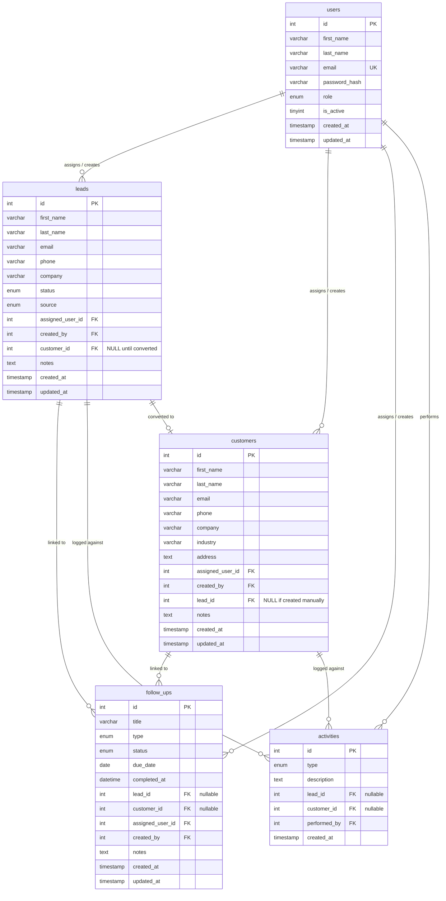

# Sales CRM Lite — Database Design

## Design Principles

- **InnoDB** engine on all tables for foreign key support and transaction safety
- **INT UNSIGNED** for all primary and foreign keys — no negative IDs
- **TIMESTAMP** with `DEFAULT CURRENT_TIMESTAMP` for audit trails (stored as UTC)
- **ENUM** for all finite value sets — enforces valid states at the DB layer
- All string columns sized conservatively; TEXT only where open-ended content is expected
- Soft delete via `is_active` on users; hard delete (with CASCADE) on operational records
- Nullable FK columns (`lead_id`, `customer_id`) use NULL to mean "not linked", not zero

---

## Entity Relationship Diagram



---

## Table Definitions

### `users`

The central authentication and authorization table. All other tables reference this via FK.

| Column | Type | Constraints | Description |
|---|---|---|---|
| `id` | INT UNSIGNED | PK, AUTO_INCREMENT | Surrogate primary key |
| `first_name` | VARCHAR(100) | NOT NULL | User's given name |
| `last_name` | VARCHAR(100) | NOT NULL | User's family name |
| `email` | VARCHAR(255) | NOT NULL, UNIQUE | Login identifier; must be unique across the system |
| `password_hash` | VARCHAR(255) | NOT NULL | bcrypt hash (`password_hash()`, cost 12) |
| `role` | ENUM('admin','sales_rep') | NOT NULL, DEFAULT 'sales_rep' | Access control role |
| `is_active` | TINYINT(1) | NOT NULL, DEFAULT 1 | Soft delete flag; 0 = cannot log in |
| `created_at` | TIMESTAMP | NOT NULL, DEFAULT CURRENT_TIMESTAMP | Record creation time (UTC) |
| `updated_at` | TIMESTAMP | NOT NULL, DEFAULT CURRENT_TIMESTAMP ON UPDATE CURRENT_TIMESTAMP | Last modification time |

**Indexes:**
```
PRIMARY KEY (id)
UNIQUE KEY  uq_users_email (email)
```

**Business rules enforced at DB level:**
- Email uniqueness prevents duplicate accounts
- `is_active = 0` is checked at login; the row is retained for data integrity

---

### `leads`

Tracks prospects in the sales pipeline. A lead can progress through statuses and optionally be converted to a customer.

| Column | Type | Constraints | Description |
|---|---|---|---|
| `id` | INT UNSIGNED | PK, AUTO_INCREMENT | |
| `first_name` | VARCHAR(100) | NOT NULL | |
| `last_name` | VARCHAR(100) | NOT NULL | |
| `email` | VARCHAR(255) | NULL | At least one of email/phone required (enforced at app layer) |
| `phone` | VARCHAR(50) | NULL | |
| `company` | VARCHAR(200) | NULL | |
| `status` | ENUM('new','contacted','qualified','proposal_sent','won','lost') | NOT NULL, DEFAULT 'new' | Pipeline stage |
| `source` | ENUM('website','referral','cold_call','linkedin','email_campaign','other') | NULL | Lead acquisition channel |
| `assigned_user_id` | INT UNSIGNED | NOT NULL, FK → users.id | The Sales Rep responsible for this lead |
| `created_by` | INT UNSIGNED | NOT NULL, FK → users.id | The user who created the record |
| `customer_id` | INT UNSIGNED | NULL, FK → customers.id | Set when the lead is converted; NULL otherwise |
| `notes` | TEXT | NULL | Free-form notes |
| `created_at` | TIMESTAMP | NOT NULL, DEFAULT CURRENT_TIMESTAMP | |
| `updated_at` | TIMESTAMP | NOT NULL, DEFAULT CURRENT_TIMESTAMP ON UPDATE CURRENT_TIMESTAMP | |

**Indexes:**
```
PRIMARY KEY (id)
KEY idx_leads_assigned_user (assigned_user_id)   -- scoped list queries
KEY idx_leads_status        (status)              -- status filter
KEY idx_leads_created_at    (created_at)          -- default sort
KEY idx_leads_company       (company)             -- search
```

**Foreign Keys:**
```
FK leads_assigned FOREIGN KEY (assigned_user_id) REFERENCES users(id) ON UPDATE CASCADE
FK leads_creator  FOREIGN KEY (created_by)       REFERENCES users(id) ON UPDATE CASCADE
FK leads_customer FOREIGN KEY (customer_id)      REFERENCES customers(id) ON DELETE SET NULL ON UPDATE CASCADE
```

> Note: `ON DELETE RESTRICT` is implicit for `assigned_user_id` and `created_by` — a user with leads cannot be deleted without first reassigning or deleting the leads. This is intentional data protection. Deactivating the user (soft delete) is the preferred action.

---

### `customers`

Represents converted leads or manually created client accounts.

| Column | Type | Constraints | Description |
|---|---|---|---|
| `id` | INT UNSIGNED | PK, AUTO_INCREMENT | |
| `first_name` | VARCHAR(100) | NOT NULL | |
| `last_name` | VARCHAR(100) | NOT NULL | |
| `email` | VARCHAR(255) | NULL | |
| `phone` | VARCHAR(50) | NULL | |
| `company` | VARCHAR(200) | NULL | |
| `industry` | VARCHAR(100) | NULL | e.g. "Technology", "Healthcare" |
| `address` | TEXT | NULL | Free-form address block |
| `assigned_user_id` | INT UNSIGNED | NOT NULL, FK → users.id | |
| `created_by` | INT UNSIGNED | NOT NULL, FK → users.id | |
| `lead_id` | INT UNSIGNED | NULL, FK → leads.id | Reference to the originating lead; NULL if created manually |
| `notes` | TEXT | NULL | |
| `created_at` | TIMESTAMP | NOT NULL, DEFAULT CURRENT_TIMESTAMP | |
| `updated_at` | TIMESTAMP | NOT NULL, DEFAULT CURRENT_TIMESTAMP ON UPDATE CURRENT_TIMESTAMP | |

**Indexes:**
```
PRIMARY KEY (id)
KEY idx_customers_assigned_user (assigned_user_id)
KEY idx_customers_email         (email)             -- search
KEY idx_customers_company       (company)           -- search
KEY idx_customers_lead_id       (lead_id)           -- reverse lookup
```

**Foreign Keys:**
```
FK customers_assigned FOREIGN KEY (assigned_user_id) REFERENCES users(id)  ON UPDATE CASCADE
FK customers_creator  FOREIGN KEY (created_by)       REFERENCES users(id)  ON UPDATE CASCADE
FK customers_lead     FOREIGN KEY (lead_id)          REFERENCES leads(id)  ON DELETE SET NULL ON UPDATE CASCADE
```

---

### `follow_ups`

Task records linked to either a lead or a customer (never both simultaneously; enforced at application layer).

| Column | Type | Constraints | Description |
|---|---|---|---|
| `id` | INT UNSIGNED | PK, AUTO_INCREMENT | |
| `title` | VARCHAR(255) | NOT NULL | Short description of the task |
| `type` | ENUM('call','email','meeting','demo','other') | NOT NULL | Task category |
| `status` | ENUM('pending','done','cancelled') | NOT NULL, DEFAULT 'pending' | Task state |
| `due_date` | DATE | NOT NULL | Target completion date (used for overdue detection) |
| `completed_at` | DATETIME | NULL | Timestamp when status changed to 'done' |
| `lead_id` | INT UNSIGNED | NULL, FK → leads.id | Linked lead; NULL if linked to a customer |
| `customer_id` | INT UNSIGNED | NULL, FK → customers.id | Linked customer; NULL if linked to a lead |
| `assigned_user_id` | INT UNSIGNED | NOT NULL, FK → users.id | |
| `created_by` | INT UNSIGNED | NOT NULL, FK → users.id | |
| `notes` | TEXT | NULL | |
| `created_at` | TIMESTAMP | NOT NULL, DEFAULT CURRENT_TIMESTAMP | |
| `updated_at` | TIMESTAMP | NOT NULL, DEFAULT CURRENT_TIMESTAMP ON UPDATE CURRENT_TIMESTAMP | |

**Indexes:**
```
PRIMARY KEY (id)
KEY idx_followups_assigned_user (assigned_user_id)
KEY idx_followups_due_date      (due_date)            -- overdue dashboard query
KEY idx_followups_status        (status)              -- filter
KEY idx_followups_lead_id       (lead_id)             -- detail page lookup
KEY idx_followups_customer_id   (customer_id)         -- detail page lookup
```

**Foreign Keys:**
```
FK followups_lead     FOREIGN KEY (lead_id)          REFERENCES leads(id)     ON DELETE CASCADE ON UPDATE CASCADE
FK followups_customer FOREIGN KEY (customer_id)      REFERENCES customers(id) ON DELETE CASCADE ON UPDATE CASCADE
FK followups_assigned FOREIGN KEY (assigned_user_id) REFERENCES users(id)     ON UPDATE CASCADE
FK followups_creator  FOREIGN KEY (created_by)       REFERENCES users(id)     ON UPDATE CASCADE
```

> Cascade delete: when a lead or customer is deleted, all their follow-ups are automatically removed.

---

### `activities` *(Phase 2)*

Immutable audit log. Records are inserted but never updated or deleted.

| Column | Type | Constraints | Description |
|---|---|---|---|
| `id` | INT UNSIGNED | PK, AUTO_INCREMENT | |
| `type` | ENUM('status_change','call','email','meeting','note','conversion') | NOT NULL | Classification of the event |
| `description` | TEXT | NOT NULL | Human-readable detail of what happened |
| `lead_id` | INT UNSIGNED | NULL, FK → leads.id | Context entity (one of the two) |
| `customer_id` | INT UNSIGNED | NULL, FK → customers.id | Context entity (one of the two) |
| `performed_by` | INT UNSIGNED | NOT NULL, FK → users.id | User who triggered the activity |
| `created_at` | TIMESTAMP | NOT NULL, DEFAULT CURRENT_TIMESTAMP | Immutable record time |

> No `updated_at` column — activities are never modified.

**Indexes:**
```
PRIMARY KEY (id)
KEY idx_activities_lead_id      (lead_id)
KEY idx_activities_customer_id  (customer_id)
KEY idx_activities_performed_by (performed_by)
KEY idx_activities_created_at   (created_at)   -- date-range queries in reporting
```

**Foreign Keys:**
```
FK activities_lead      FOREIGN KEY (lead_id)     REFERENCES leads(id)     ON DELETE SET NULL ON UPDATE CASCADE
FK activities_customer  FOREIGN KEY (customer_id) REFERENCES customers(id) ON DELETE SET NULL ON UPDATE CASCADE
FK activities_user      FOREIGN KEY (performed_by) REFERENCES users(id)    ON UPDATE CASCADE
```

---

## Relationships Summary

| Relationship | Type | Description |
|---|---|---|
| users → leads | 1:N (assigned_user_id) | One user can be assigned many leads |
| users → leads | 1:N (created_by) | One user can create many leads |
| users → customers | 1:N | One user can be assigned many customers |
| users → follow_ups | 1:N | One user can have many follow-ups |
| users → activities | 1:N | One user can perform many activities |
| leads → customers | 1:0..1 | A lead converts to at most one customer |
| customers → leads | 0..1:1 | A customer may originate from one lead |
| leads → follow_ups | 1:N | A lead can have many follow-ups |
| customers → follow_ups | 1:N | A customer can have many follow-ups |
| leads → activities | 1:N | All interactions against a lead |
| customers → activities | 1:N | All interactions against a customer |

---

## ENUM Value Reference

### Lead Status (pipeline stages in order)
```
new → contacted → qualified → proposal_sent → won
                                            → lost
```

| Value | Meaning |
|---|---|
| `new` | Just entered; no contact attempted |
| `contacted` | First contact made |
| `qualified` | Confirmed interest and budget |
| `proposal_sent` | Offer has been submitted |
| `won` | Deal closed — eligible for conversion |
| `lost` | Deal closed negatively |

### Lead Source
`website` · `referral` · `cold_call` · `linkedin` · `email_campaign` · `other`

### Follow-Up Type
`call` · `email` · `meeting` · `demo` · `other`

### Follow-Up Status
`pending` → `done` | `cancelled`

### Activity Type *(Phase 2)*
`status_change` · `call` · `email` · `meeting` · `note` · `conversion`

### User Role
`admin` · `sales_rep`

---

## Key Queries (Reference)

**Dashboard — pending follow-ups due today or overdue (role-scoped):**
```sql
SELECT fu.*, l.first_name AS lead_fn, c.first_name AS cust_fn
FROM   follow_ups fu
LEFT   JOIN leads     l ON fu.lead_id     = l.id
LEFT   JOIN customers c ON fu.customer_id = c.id
WHERE  fu.status           = 'pending'
  AND  fu.due_date        <= CURDATE()
  AND  fu.assigned_user_id = :user_id   -- omit for Admin
ORDER  BY fu.due_date ASC
LIMIT  5;
```

**Leads list — with search + status filter:**
```sql
SELECT l.*, CONCAT(u.first_name, ' ', u.last_name) AS assigned_to
FROM   leads l
JOIN   users u ON l.assigned_user_id = u.id
WHERE  l.assigned_user_id = :user_id            -- omit for Admin
  AND  (:status = '' OR l.status = :status)
  AND  (:q = '' OR l.first_name  LIKE :q
                OR l.last_name   LIKE :q
                OR l.company     LIKE :q)
ORDER  BY l.created_at DESC;
```

**Reporting — leads by status (Admin):**
```sql
SELECT status, COUNT(*) AS total
FROM   leads
WHERE  created_at BETWEEN :from AND :to
GROUP  BY status;
```
